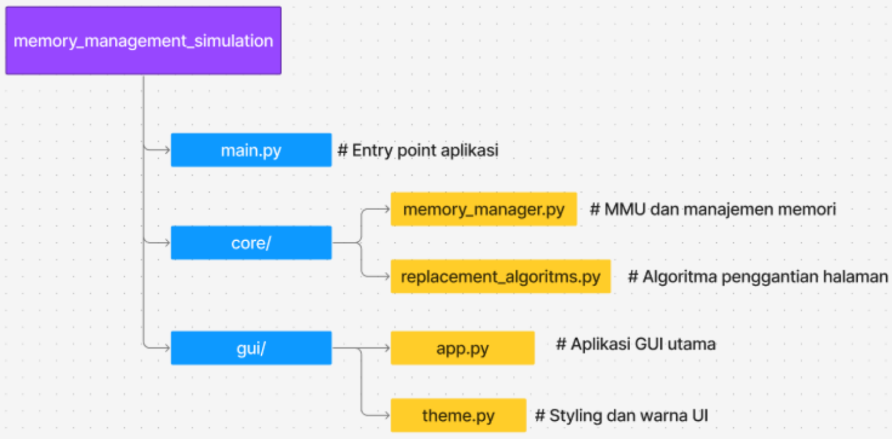

# Virtual Memory Simulator

## Deskripsi
Simulator sistem manajemen memori virtual dengan paging yang dikembangkan untuk mata kuliah Sistem Operasi. Aplikasi ini mensimulasikan cara kerja Memory Management Unit (MMU) dalam menangani translasi alamat virtual ke alamat fisik, page fault, dan algoritma penggantian halaman dengan antarmuka grafis interaktif untuk membantu proses pembelajaran.

## Fitur Utama
- **Simulasi Memori Virtual**: Implementasi lengkap sistem paging dengan page table dan translasi alamat
- **Algoritma Penggantian Halaman**: 
  - FIFO (First-In, First-Out)
  - LRU (Least Recently Used)
- **Interface Grafis**: GUI interaktif menggunakan CustomTkinter dengan visualisasi real-time
- **Visualisasi Komprehensif**: 
  - Tampilan Page Table
  - Ruang Alamat Virtual (Virtual Address Space)
  - Memori Fisik (Physical Memory)
- **Analisis Performa Mendalam**: 
  - Hit Ratio dan Page Fault tracking
  - Waktu eksekusi dan throughput
  - Penggunaan memori puncak
- **Mode Eksekusi Fleksibel**: Akses alamat individual atau batch reference string
- **Manajemen Multi-Proses**: Dukungan untuk beberapa proses dengan context switching

## Struktur Proyek


## Requirements
```
customtkinter>=5.0.0
tkinter (built-in dengan Python)
```

## Instalasi
1. Clone repository atau download source code
2. Install dependencies:
   ```bash
   pip install customtkinter
   ```
3. Jalankan aplikasi:
   ```bash
   python main.py
   ```

## Cara Penggunaan

### 1. Konfigurasi Sistem
- **Frame Fisik**: Atur jumlah frame di memori fisik menggunakan slider (4-64 frame)
- **Algoritma**: Pilih algoritma penggantian (FIFO/LRU) melalui radio button
- Klik **"Mulai / Reset Simulasi"** untuk menginisialisasi sistem

### 2. Membuat Proses
- Atur jumlah halaman virtual untuk proses menggunakan slider
- Klik **"Buat Proses"** untuk membuat proses baru
- Pilih proses aktif dari dropdown list untuk context switching

### 3. Akses Memori
#### Akses Individual:
- Masukkan alamat virtual dalam byte (contoh: 8192)
- Klik **"Akses Alamat"** untuk melihat proses translasi

#### Batch Reference String:
- Masukkan string referensi halaman (contoh: 0,1,2,3,0,1,4,2,1,0,3,2)
- Klik **"Jalankan String Referensi"** untuk eksekusi batch dengan analisis performa

### 4. Monitoring dan Visualisasi
- **Panel Log**: Menampilkan aktivitas sistem secara real-time dengan detail operasi
- **Page Table**: Visualisasi mapping halaman virtual ke frame fisik
- **Virtual Address Space**: Status semua halaman proses (di memori/disk)
- **Physical Memory**: Status frame dan alokasi memori
- **Statistik Performa**: 
  - Page Hits & Page Faults
  - Hit Ratio (%)
  - Waktu Eksekusi (ms)
  - Penggunaan Memori Puncak (MB)
  - Throughput (referensi per detik)

## Algoritma yang Diimplementasikan

### FIFO (First-In, First-Out)
- **Prinsip**: Mengganti halaman yang pertama kali masuk ke memori (paling lama berada di memori)
- **Implementasi**: Menggunakan struktur data `deque` untuk efisiensi O(1)
- **Keuntungan**: Implementasi sederhana, overhead komputasi rendah
- **Kerugian**: Performa seringkali buruk, rentan terhadap Anomali Belady
- **Use Case**: Sistem dengan prioritas pada kesederhanaan dan kecepatan

### LRU (Least Recently Used)
- **Prinsip**: Mengganti halaman yang paling lama tidak diakses berdasarkan lokalitas referensi
- **Implementasi**: Menggunakan `usage_order` list untuk tracking penggunaan
- **Keuntungan**: Performa optimal untuk sebagian besar pola akses, tidak mengalami Anomali Belady
- **Kerugian**: Overhead lebih tinggi karena tracking setiap akses memori
- **Use Case**: Sistem tujuan umum dengan beban kerja yang memiliki lokalitas referensi

## Arsitektur Sistem

### Komponen Inti:
1. **Memory Management Unit (MMU)**: 
   - Translasi alamat virtual ke fisik
   - Penanganan page fault
   - Koordinasi dengan algoritma penggantian

2. **Physical Memory**: 
   - Manajemen frame fisik
   - Alokasi dan dealokasi frame
   - Tracking konten setiap frame

3. **Process & Page Table**: 
   - Representasi proses dengan page table
   - Page Table Entry (PTE) dengan valid bit dan frame number

4. **Replacement Algorithm Module**: 
   - Antarmuka standar untuk algoritma
   - Implementasi FIFO dan LRU yang dapat dipertukarkan

## Skenario Testing yang Direkomendasikan

### 1. Pola Sekuensial (Test Case 1):
- **Reference String**: `0,1,2,3,4,5,6,7,8,9`
- **Tujuan**: Menguji kinerja tanpa lokalitas referensi
- **Expected**: Kedua algoritma memiliki performa identik dan buruk

### 2. Pola Lokalitas Tinggi (Test Case 2):
- **Reference String**: `0,1,2,0,1,3,0,1,4,0,1,5,0,1`
- **Tujuan**: Simulasi program dengan loop
- **Expected**: LRU signifikan lebih unggul dari FIFO

### 3. Pola Acak Standar (Test Case 3):
- **Reference String**: `7,0,1,2,0,3,0,4,2,3,0,3,2`
- **Tujuan**: Perbandingan pada beban kerja umum
- **Expected**: LRU lebih baik dengan memanfaatkan lokalitas parsial

### 4. Anomali Belady (Test Case 4):
- **Reference String**: `1,2,3,4,1,2,5,1,2,3,4,5`
- **Tujuan**: Membuktikan kerentanan FIFO terhadap anomali
- **Expected**: FIFO menunjukkan anomali, LRU konsisten

## Color Coding Visualisasi
- 🟢 **Hijau**: Page Hit
- 🟠 **Oranye**: Page Fault dengan frame kosong
- 🔴 **Merah**: Page Fault dengan penggantian
- 🔵 **Biru**: Frame terisi / halaman valid
- ⚫ **Abu-abu**: Frame kosong / halaman di disk
- **Warna Unik**: Setiap proses memiliki warna berbeda

## Troubleshooting

### Error "Process ID tidak ditemukan"
- Buat proses terlebih dahulu sebelum mengakses memori
- Pastikan proses dipilih dari dropdown list

### Error "Format String Referensi tidak valid"
- Gunakan format: `1,2,3,4` (dipisah koma)
- Pastikan semua nilai adalah nomor halaman yang valid

### GUI Tidak Responsive
- Tutup dan restart aplikasi
- Reduce ukuran reference string untuk testing awal

### Hasil Tidak Sesuai Ekspektasi
- Periksa konfigurasi jumlah frame dan ukuran halaman
- Verifikasi algoritma yang dipilih
- Pastikan proses yang benar sedang aktif

## Pengembangan dan Ekstensibilitas

### Menambah Algoritma Baru:
1. Inherit dari `ReplacementAlgorithm` base class
2. Implement method: `page_loaded`, `select_victim`, `page_accessed`, `reset`
3. Tambahkan ke algoritma mapping di GUI

### Struktur Data Kunci:
- **PageTableEntry**: `frame_number`, `valid` bit
- **Process**: `pid`, `page_table`, `num_pages`
- **PhysicalMemory**: `frames`, `free_frames`, tracking
- **FIFO**: `queue` menggunakan deque
- **LRU**: `usage_order` menggunakan list

## Analisis Performa Trade-off

Berdasarkan eksperimen pada Test Case 2 (Pola Lokalitas Tinggi):

| Metrik | FIFO | LRU | Analisis |
|--------|------|-----|----------|
| Page Faults | 8 | 6 | LRU 25% lebih efektif |
| Hit Ratio | 42.9% | 57.1% | LRU lebih unggul |
| Waktu Eksekusi | 2947.42 ms | 2999.01 ms | FIFO 1.7% lebih cepat |
| Puncak Memori | 0.5572 MB | 0.5192 MB | LRU lebih hemat |
| Throughput | 4.07 ref/s | 4.00 ref/s | FIFO sedikit lebih tinggi |

**Kesimpulan**: LRU lebih efektif dalam mengurangi page fault tetapi memiliki overhead komputasi yang lebih tinggi.

## Kontributor
Kelompok 3 - Mata Kuliah Sistem Operasi:
1. Fadhlurohman Dzaki (2306202132)
2. Hadyan Fachri (2306245030)
3. Akhyar Rasyid As (2306241682)
4. Kevin Yezekhiel Manurung (2206826974)
5. Muhammad Ruzbehan Baqli (2306245062)

## Referensi Akademik
- Arpaci-Dusseau, R. H., & Arpaci-Dusseau, A. C. (2024). Operating Systems: Three Easy Pieces
- Silberschatz, A., Galvin, P. B., & Gagne, G. (2018). Operating System Concepts (10th ed.)
- Tanenbaum, A. S., & Bos, H. (2015). Modern Operating Systems (4th ed.)

## Kata Kunci
Memori Virtual, Algoritma Penggantian Halaman, FIFO, LRU, Page Fault, Simulator, Sistem Operasi, Analisis Kinerja, Lokalitas Referensi, MMU, Paging.

---
**Catatan**: Simulator ini dibuat untuk tujuan pembelajaran konsep memori virtual dan tidak mencerminkan kompleksitas penuh sistem manajemen memori di sistem operasi production. Fokus utama adalah pada pemahaman algoritma penggantian halaman dan visualisasi interaktif proses manajemen memori.